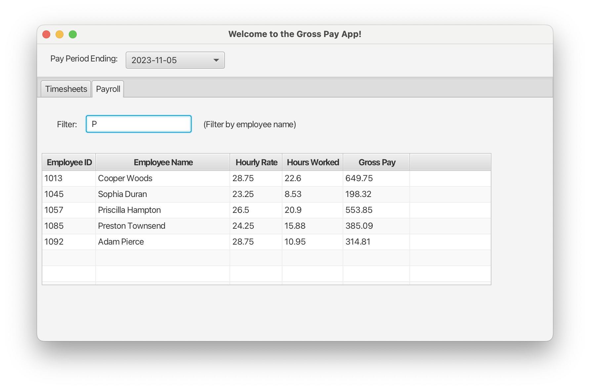

<h1 align="center">Gross Pay App</h1>

<strong>This project represents the work I learned and applied as a result of taking CSC 2040 Java Programming.</strong>
 

<h2>About</h2>
This program allows a member of a Payroll team or HR to review, add, or delete timesheet entries as hourly employees may need modifications to their time sheets before approving submittals in the HR system. This is especially relevant with time reporting systems may have the following limitations:
- Hourly employees can may only perform check in and check out activities from their phones
- Once submitted there is no way to edit if they hit the wrong button at the wrong time
- Restricting timesheet entry activities with employees physically located within a designated geofencing area   

<h2>Technologies</h2>
For CSC 2040 Java Programming, I focused on learning JavaFX, working with FXML documents, TableViews, and Classes. I also added Maven to this final project to managing dependencies.

<h2>Goal and requirements</h2>
The assignment for the final was to create an original JavaFX application that reads inputs and processes it into another set of outputs to be displayed to the user.

Requirements for this project were to apply advanced concepts with at least 3 of the following:
<ul>
<li> classes (included)</li>
<li> THIS-references (included)</li>
<li> Controls & Collections (included)</li>
<li> Exception Handling (included)</li>
<li> File operations (included)</li>
</ul>

<h2>Skills Acquired</h2>

- Building an FXML document and interfacing with it
- Recognizing what types of classes are needed to organize code with
   TableView controls  
- Adding rows and deleting rows from a TableView 
- Using LocalDateTime and LocalDate for a number of tasks 
- Building a data generator to avoid having to make large timesheet files
- Exception handling within a constructor

<h2>Usage</h2>

Read the [term project submittal](M5_Final_KruseMatthew.pdf) to learn how to generate sample timesheets and use to program. 

<h2>Future areas to focus on</h2>

- There would be a database that has the tables to eliminate a lot of redundancy for storing and processing things like employee name, work location, and pay rate. This would allow me to use a ComboBox to select employees instead of having to look up and type in their information.

- With the UI, have an edit record option. Consider updating the interface to allow editable cells in the table views.

- Through some testing, I later discovered that filtering does not work right while adding and deleting records. I would spend some time to fix this, along with adding unit tests which were not covered in the class.

